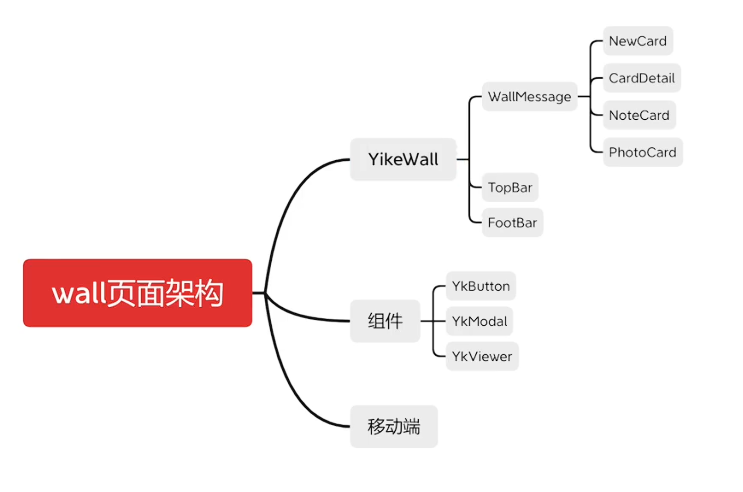

# 开发文档

## 文件结构
```
|-- yike
    |-- .gitignore
    |-- index.html
    |-- jsconfig.json
    |-- package-lock.json
    |-- package.json
    |-- README.md
    |-- vite.config.js
    |-- .vscode
    |   |-- extensions.json
    |   |-- settings.json
    |-- public
    |   |-- favicon.ico
    |-- src
    |   |-- App.vue
    |   |-- main.js
    |   |-- api
    |   |-- assets
    |   |   |-- fonts
    |   |   |-- images
    |   |-- components
    |   |-- router  //存放路由文件
    |   |-- views    //存放路由视图
    |   |-- store   //vuex组件状态管理
    |   |-- utils   //公共资源
    |-- static  //全局静态资源
```
## 项目初始
创建vue项目 引入vuex,vue-router

## 全局引入less
[原文链接](https://www.jianshu.com/p/4dd7cb87eae3)

## 引入iconfont
[iconfont官网](https://www.iconfont.cn/)

## 整体组件结构


## 引入mock插件
```npm install mockjs --save```